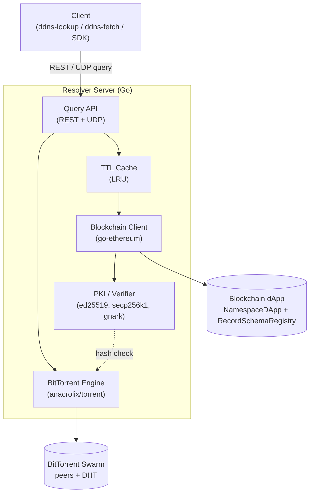

# Decentralized DNS

> A blockchain-native DNS **and** Public Key Infrastructure — no ICANN, no registrars,
> no certificate authorities. Namespaces live on-chain, large static content lives on
> BitTorrent, and every answer is cryptographically verifiable end-to-end.

[](https://github.com/devCana/decentralized-dns/actions/workflows/ci.yml)
[](./LICENSE)
[](https://go.dev/)
[](https://soliditylang.org/)

Decentralized DNS replaces the centrally-administered DNS + X.509 stack with three
cooperating decentralized tiers:

- a **Solidity dApp** that owns the namespace registry, the typed record store, and a
  dynamic record-type schema registry;
- a **Go resolver server** that answers REST/UDP queries through a TTL cache, reads the
  chain on a miss, verifies owner signatures, generates zero-knowledge proofs, and serves
  BitTorrent-hosted files only after re-hashing them against the on-chain hash;
- the **BitTorrent swarm**, which stores bulk static content that is too large (and too
  expensive) to keep on-chain.

The only trusted authorities are the blockchain consensus itself and each domain owner's
private key. A resolver can never forge or tamper with an answer without being detected
by the client.

---

## Table of contents

- [Architecture](#architecture)
- [Features](#features)
- [Repository layout](#repository-layout)
- [Quick start](#quick-start)
- [Resolver REST API](#resolver-rest-api)
- [UDP query protocol](#udp-query-protocol)
- [Command-line tools](#command-line-tools)
- [Smart contracts](#smart-contracts)
- [Security & trust model](#security--trust-model)
- [Development](#development)
- [Documentation](#documentation)
- [Project status](#project-status)
- [Authors & license](#authors--license)

---

## Architecture



A standard lookup hits the in-memory TTL cache. On a miss the resolver reads the record
plus the domain identity from the chain in a single call, verifies the owner's EIP-191
signature, optionally produces a Groth16 proof that the served payload matches the
on-chain commitment, signs the whole response with its own ed25519 identity key, and
caches it for the record's TTL. For a `ResourceRef`, it additionally fetches the file
over BitTorrent and re-computes SHA-256 before a single byte reaches the client.

See [`docs/high-level-design.md`](./docs/high-level-design.md) for the full design,
including sequence diagrams for registration, cache hit/miss, and resource fetch.

## Features

| Feature | Status | Notes |
|---|---|---|
| Decentralized namespace registration / renewal / transfer | ✅ | Length-based pricing, 1-year periods, on-chain fee collection |
| Typed record store with schema validation | ✅ | Mandatory/optional fields enforced on-chain (`RecordSchemaRegistry`) |
| Dynamic record-type expansion | ✅ | New record types declared permissionlessly (UC-9) |
| Extended query selectors (port / transport / service) | ✅ | `?selector=service=HTTP&transport=TCP&port=443` |
| TTL caching resolver with event-driven invalidation | ✅ | LRU + per-record TTL; chain events evict stale entries |
| Owner-signature (PKI) verification | ✅ | secp256k1 EIP-191 signatures recovered to the on-chain pubkey |
| Resolver-identity response signatures | ✅ | Every REST/UDP answer sealed in an ed25519 envelope |
| Zero-knowledge record-commitment proofs | ✅ | gnark MiMC circuit, Groth16, on-chain `ZKVerifier` |
| BitTorrent `ResourceRef` storage with hash verification | ✅ | Tampered files are discarded, never served |
| REST query API | ✅ | `/resolve`, `/resource`, `/domains/{name}`, `/types`, `/healthz` |
| UDP query API (secondary) | ✅ | Compact binary TLV wire format |
| Owner CLI + lookup/fetch client tools | ✅ | `ddns`, `ddns-lookup`, `ddns-fetch` |
| Resolver incentive economics | ⛔ | Out of scope (nice-to-have) |
| Native browser integration | ⛔ | Out of scope (nice-to-have) |

## Repository layout

```
decentralized-dns/
├── contracts/                 # Hardhat workspace — the on-chain dApp
│   ├── contracts/
│   │   ├── NamespaceDApp.sol          # registry, records, fees, transfer
│   │   ├── RecordSchemaRegistry.sol   # dynamic record-type schemas
│   │   └── ZKVerifier.sol             # gnark-exported Groth16 verifier
│   ├── scripts/               # deploy, seed, record-signing helper
│   └── test/                  # Hardhat test suite (34 tests)
├── resolver/                  # Go resolver server + CLIs
│   ├── cmd/
│   │   ├── resolver/          # the resolver daemon
│   │   ├── ddns/              # domain-owner CLI (register/set/transfer/…)
│   │   ├── ddns-lookup/       # query a resolver + verify the response
│   │   ├── ddns-fetch/        # resolve a ResourceRef to disk
│   │   ├── record-commit/     # dev tool: compute a record's ZK commitment
│   │   └── zkgen/             # dev tool: Groth16 trusted-setup ceremony
│   └── internal/
│       ├── server/            # REST + UDP front ends, rate limiting
│       ├── chain/             # go-ethereum client + generated bindings
│       ├── cache/             # TTL LRU cache
│       ├── pki/               # ed25519 identity + secp256k1 owner sigs
│       ├── zk/                # gnark circuit, prove/verify
│       ├── torrent/           # anacrolix/torrent engine + SHA verification
│       ├── query/             # query parsing/normalization
│       └── config/            # environment configuration
├── docs/                      # design documentation (Markdown)
├── docker-compose.yml         # local chain + resolver topology
└── Makefile                   # build / test / deploy / demo targets
```

## Quick start

### Prerequisites

- **Go** 1.25+
- **Node.js** 22+ (for the Hardhat contract workspace)
- **make**

### One-command demo

```bash
make demo
```

This boots a local Hardhat node, deploys the contracts, builds and starts the Go
resolver, registers a sample domain, seeds a sample file, and runs an end-to-end query —
the reproducible path for graders and first-time readers.

### Manual setup

```bash
# 1. Contracts: install, compile, start a local chain, deploy + seed
make contracts-install
make chain                 # in a separate terminal — runs `hardhat node`
make deploy-localhost      # writes contracts/deployments/localhost.json
make seed-localhost        # registers a demo domain + records

# 2. Resolver: configure and run
cd resolver
cp .env.example .env       # set CONTRACT_ADDRESS / REGISTRY_ADDRESS from the deploy output
go run ./cmd/resolver

# 3. Query it
curl 'http://localhost:8080/resolve?name=example&type=A'
```

## Resolver REST API

All successful responses are wrapped in a resolver-signed ed25519 envelope so clients can
authenticate the resolver. Binary fields are `0x`-hex so signatures and commitments can be
re-verified byte-exactly.

| Method & path | Purpose |
|---|---|
| `GET /healthz` | Liveness + current chain head (exempt from rate limiting) |
| `GET /resolve?name=&type=&selector=&port=&transport=&service=` | Resolve a single record (UC-4/UC-5) |
| `GET /resource?name=&selector=&peer=` | Resolve a `ResourceRef` and stream the verified file bytes (UC-6) |
| `GET /domains/{name}` | Raw domain state + all live records |
| `GET /types` | All declared record types |

**Example**

Successful responses are wrapped in a signed envelope `{ data, resolver, signature }`;
`.data` is the resolve result:

```console
$ curl -s 'http://localhost:8080/resolve?name=example&type=A' | jq .data
{
  "query":  { "name": "example", "type": "A", "selector": "" },
  "found":  true,
  "record": { "type": "A", "fieldNames": ["address"], "fieldValues": ["93.184.216.34"], "ttl": 3600, ... },
  "owner":  "0x…",
  "pubKey": "0x04…",
  "ownerSigVerified": true,
  "cached": false
}
```

A missing record is a typed, authoritative "no match" (`found:false`, `error:no_match`)
returned with HTTP 200 — the decentralized equivalent of `NXDOMAIN`.

## UDP query protocol

As a secondary, low-latency front end the resolver also speaks a compact binary protocol
on `UDP_PORT` (default `5353`). Packets use a 6-byte header (`"DDNS"` magic, 1-byte
version, 1-byte flags/status) followed by length-prefixed TLV fields for the name, type,
and selector. The response carries the same resolver-signed JSON envelope as the REST API
inside a TLV. See [`resolver/internal/server/udp.go`](./resolver/internal/server/udp.go).

## Command-line tools

### `ddns` — domain-owner CLI

Signs every transaction locally with the owner's key (`--key` or `DDNS_PRIVATE_KEY`); the
private key never leaves the machine and is never sent to a resolver. Contract addresses
are read from `--deployments` (default `contracts/deployments/localhost.json`).

```bash
ddns register example                                    # register a name (pays the on-chain fee)
ddns set example A address=93.184.216.34                 # sign + store an A record (ttl 3600 default)
ddns set example SVC --selector "service=SMTP&transport=TCP&port=25" \
    target=mail.example service=SMTP transport=TCP port=25
ddns publish-resource example ./site.html --selector service=HTTP   # seed + anchor a ResourceRef
ddns transfer example 0xNEWOWNER --pubkey 0x04...        # hand over ownership (new owner's pubkey)
ddns renew example                                       # extend the registration
ddns declare-type GEO --mandatory lat,lon                # declare a new record type
```

Flags may appear before or after positional arguments.

### `ddns-lookup` — verifying client

Independently re-checks the cryptography (it does not just trust the resolver's flags):
the resolver's ed25519 envelope, the owner's secp256k1 record signature recovered against
the on-chain pubkey, and the Groth16 commitment proof.

```bash
ddns-lookup example A
ddns-lookup example SVC --selector "service=SMTP&transport=TCP&port=25"
```

```text
resolver:  0x055b…470f (envelope signature OK)
owner:     0x7099…79C8
record:    A address=93.184.216.34 (ttl=3600s)
owner sig: OK (recovered to on-chain pubKey + owner address)
zk proof:  OK (Groth16 commitment proof verifies)
```

### `ddns-fetch` — resource downloader

Resolves a `ResourceRef`, downloads the BitTorrent-hosted file through the resolver, and
verifies the body's SHA-256 against the on-chain hash and the resolver's provenance
signature before writing it out.

```bash
ddns-fetch example --selector service=HTTP -o site.html   # fetch + verify to disk
```

## Smart contracts

- **`NamespaceDApp`** — the on-chain authority. Domains keyed by `keccak256(name)` store
  owner address, public key, expiry, and a *generation* counter that logically
  invalidates records left behind by a previous owner. Enforces length-based pricing,
  single-owner access control, schema-validated record writes, and CEI-pattern fee
  refunds. Emits `Registered` / `Renewed` / `Transferred` / `RecordSet` / `RecordRemoved`
  for resolver cache invalidation.
- **`RecordSchemaRegistry`** — declares record types and their mandatory/optional fields,
  consulted on every record write so dynamic types validate without protocol changes.
- **`ZKVerifier`** — gnark-exported Groth16 verifier for the record-commitment circuit.

## Security & trust model

- **End-to-end integrity.** Records are signed by the domain owner's secp256k1 key
  (EIP-191); the resolver and clients recover the signer and check it against the
  on-chain public key and owner address. A resolver cannot alter a record undetected.
- **Resolver authentication.** Every response is sealed in an ed25519 envelope keyed to
  the resolver's published identity, so clients can pin and verify which resolver
  answered.
- **Content integrity.** `ResourceRef` files are re-hashed (SHA-256) against the on-chain
  hash before being served; a tampered or forged file is discarded and the resolver
  retries another peer (UC-10).
- **Zero-knowledge commitments.** A Groth16 proof attests that the served payload matches
  the record's on-chain MiMC commitment, verifiable on-chain via `ZKVerifier`.
- **Sybil resistance.** Because clients verify on-chain signatures and never trust a
  single resolver, running many fake resolvers gains an attacker nothing.

## Development

```bash
make build            # compile contracts + resolver
make test             # hardhat tests + go vet + go test
make contracts-test   # Hardhat suite only
make resolver-test    # go vet ./... && go test ./...
make bindings         # regenerate Go contract bindings (abigen)
make zk-setup         # regenerate the Groth16 artifacts + verifier (dev only)
make clean
```

CI (`.github/workflows/ci.yml`) compiles and tests both the contracts and the resolver on
every push and pull request.

## Documentation

- [High-Level Design](./docs/high-level-design.md) — architecture, flows, class diagram,
  use cases, references.
- [Functional Specification](./docs/functional-spec.md) — features, scope, assumptions.

## Project status

This is an academic project built to demonstrate a working decentralized DNS + PKI. The
contracts and resolver are feature-complete for the implemented scope (all main and
secondary features above), with passing test suites on both sides. The resolver-incentive
economic model and native browser integration are intentionally out of scope.

## Authors & license

Built by **Mohammed Awawdi**, **Ibrahim Kamel**, and **Ahmad Ghanayim**.

Released under the [MIT License](./LICENSE).
