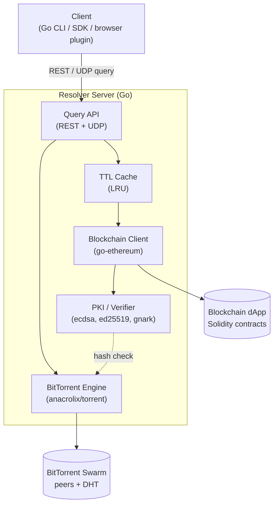
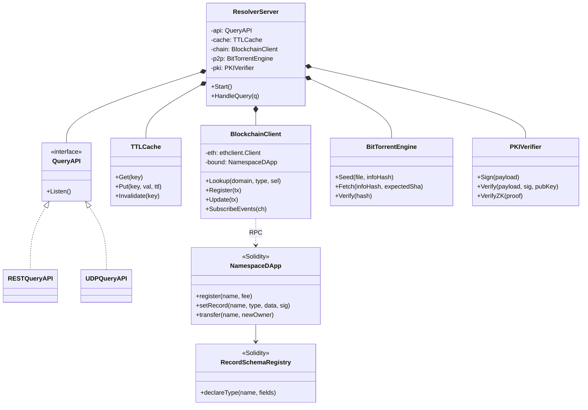
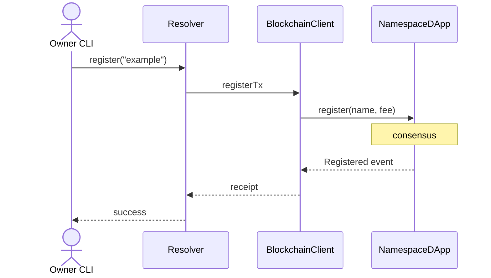
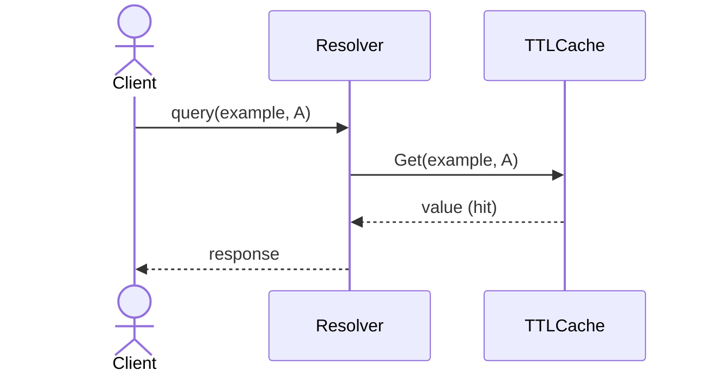
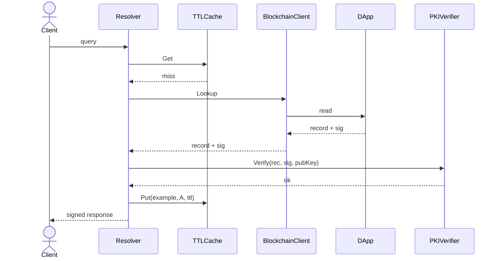
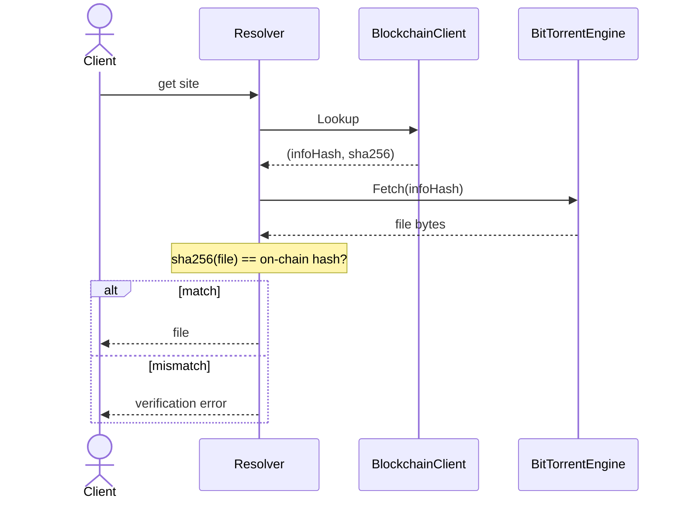

# High-Level Design — Decentralized DNS

| | |
|---|---|
| **Author** | Mohammed Awawdi, Ibrahim Kamel, Ahmad Ghanayim |
| **Version** | V0.1 |
| **Created** | 2026-05-22 |
| **Last updated** | 2026-05-22 |

> This document is the Markdown conversion of the original `HLD.pdf`. Diagrams have
> been reconstructed as [Mermaid](https://mermaid.js.org/) so they render natively on
> GitHub and stay in version control. For actual build/run instructions, see the
> repository [README](../README.md).

## Introduction

This section specifies what we are actually implementing (a subset of the
[Functional Specification](./functional-spec.md), V0.1, 2026-04-13).

### Overview

This document describes the high-level design of the Decentralized DNS project: a
brand-new DNS and Public Key Infrastructure (PKI) that replaces traditional central
authorities with a blockchain-based decentralized application (dApp) and a custom
Resolver Server, integrated with a BitTorrent peer-to-peer network for static-resource
distribution.

The implementation scope covered by this HLD includes:

- A Solidity-based **dApp (smart contract)** that manages namespace registration,
  ownership transfer, record updates, and fee collection on a local/Testnet blockchain.
- A **Resolver Server** written in Go (on Linux) exposing a RESTful API (and, as a
  secondary feature, a UDP listener) that processes client queries, caches responses
  based on TTL, interacts with the blockchain via Web3 RPC, and participates in the
  BitTorrent network.
- A **Resource Reference** record type that bridges on-chain SHA hashes with off-chain
  BitTorrent-hosted static files, preserving integrity through cryptographic
  verification.
- **Integrated PKI / cryptographic proofs** (digital signatures, and where feasible
  Zero-Knowledge Proofs) attesting to the authenticity of DNS responses, replacing
  DNSSEC and mitigating Sybil attacks.
- **Extended query semantics** supporting port, transport (UDP/TCP/QUIC) and service
  (HTTP/SMTP) selectors, and **dynamic record expansion** allowing new record types with
  mandatory/optional fields to be defined without protocol changes.

Both originally-deferred "nice-to-haves" are now addressed. The resolver-incentive model
is implemented as pay-per-query micropayment channels (`ResolverIncentives`) — clients pay
for the queries they make, so there is no gameable volume oracle; see
[incentives.md](./incentives.md). Native browser integration ships in two parts: a
server-side `/web/<name>` gateway that renders a verified decentralized site in any
browser, plus a Manifest V3 extension (`extension/`) adding omnibox resolution and
in-browser envelope verification. These complete the implemented scope; a full tokenomic
economy and a native `ddns://` OS-level protocol handler remain genuine future work.

### Assumptions and design constraints

**Assumptions**

- The system operates as a new, independent standard. It is **not** required to be
  backward compatible with, or run in parallel to, the global legacy DNS hierarchy (root
  servers, ICANN, registrars).
- Reliable open-source BitTorrent client libraries are available and embeddable in the
  Resolver Server runtime.
- A local blockchain (Hardhat/Truffle) is available during development; a public
  Ethereum-compatible Testnet (e.g., Sepolia) will be used for the final demo.
- End users interact through the Resolver Server; they are not required to run their own
  blockchain node.
- Domain owners control a key pair whose public key is registered on-chain; signing keys
  are kept off-chain by the owner.

**Design constraints**

- **Storage cost on-chain:** blockchain storage is expensive and bounded — only namespace
  metadata, public keys, record entries, and content hashes are stored on-chain. Bulk
  static content **must** live on BitTorrent.
- **Latency:** every blockchain read incurs network/RPC latency far above legacy DNS. The
  Resolver Server **must** rely on TTL-based caching to deliver acceptable response times.
- **Determinism in Solidity:** contract logic must avoid floating-point arithmetic,
  unbounded loops, and external calls that could revert state.
- **Gas budget:** every write (registration, update, transfer) must fit within a
  reasonable gas limit; data structures are designed accordingly.
- **Backend runtime:** Go 1.22+ on Linux; the resolver compiles to a single
  statically-linked binary, simplifying deployment.
- **Trust model:** the only trusted authority is the blockchain consensus itself plus the
  registered domain owners' private keys.

### Distributed & parallel aspects

The project is, by definition, a distributed system: state lives across three independent
networks — the **blockchain**, the **BitTorrent swarm**, and a fleet of **Resolver
Servers** that all clients share. Compared with a monolithic DNS (one authoritative
server, one database), this introduces several difficulties:

1. **Eventual consistency** between on-chain writes and what every Resolver currently
   caches.
2. **Partial failures** — the blockchain RPC, the BitTorrent tracker/DHT, or a single
   resolver may each be down independently.
3. **Integrity in an untrusted network** — clients must be able to detect that a Resolver
   returned a stale or forged answer.
4. **Concurrent ownership conflicts** during domain registration, which centralized
   registries normally serialize behind a single database.

We address these challenges directly in the design. Eventual consistency is handled by
the **TTL caching layer** on the Resolver and by treating the blockchain as the single
source of truth — on cache miss or after TTL expiry the Resolver re-reads from chain.
Integrity is enforced **end-to-end** with cryptographic signatures and the on-chain SHA
hash of any Resource Reference: a client (or the Resolver itself) can verify that a
BitTorrent-served file matches the hash recorded on-chain, and that record updates are
signed by the registered owner's key. Concurrency on registration is solved natively by
the blockchain consensus — only one transaction can claim a free namespace, and the
contract rejects all others atomically. Partial failures are mitigated by Resolver
redundancy (any client can switch to another Resolver) and by BitTorrent's inherent
multi-peer redundancy.

The project is **inherently distributed** because the whole point of the design is to
remove single points of trust and control: namespace ownership is global, public, and
tamper-resistant only because it is replicated across thousands of blockchain nodes;
static content is censorship-resistant only because it is replicated across BitTorrent
peers. A monolithic equivalent would simply be classical DNS — which is exactly the
system we are replacing. The benefits that make this interesting as a distributed system
are concrete: censorship resistance (no registrar can revoke a domain), cryptographic
auditability of every change, native PKI without the X.509 CA cartel, and resilient
content delivery via BitTorrent that scales horizontally with demand instead of
collapsing under it.

### Dependencies

| Dependency | Purpose | Backup plan |
|---|---|---|
| **Solidity toolchain** (Hardhat / Truffle, solc) | Authoring, compiling, testing, and deploying the dApp. | Hardhat is primary; Truffle and Foundry are drop-in alternatives if Hardhat tooling regresses. |
| **go-ethereum** (`github.com/ethereum/go-ethereum`) — ethclient, accounts/abi/bind, abigen | Resolver-to-blockchain RPC, ABI binding generation, keystore, and signing primitives. | `ethclient` is the primary entry point; if a feature is missing we drop down to the lower-level `rpc` package. |
| **BitTorrent library** — `anacrolix/torrent` (Go) | Seeding, fetching, and verifying P2P static files from inside the resolver process. | If `anacrolix/torrent` proves unstable, fall back to a thin Go RPC client against a local Transmission daemon. |
| **Cryptographic libraries** — Go `crypto/ecdsa`, `crypto/ed25519`, `golang.org/x/crypto`; ZK via **gnark** (`github.com/consensys/gnark`) | Generating and verifying signatures and (optionally) zero-knowledge proofs over query responses. | If gnark proves too heavy in the time budget, fall back to plain ECDSA signatures over the response payload — a strict subset of the original PKI guarantee. |
| **Public Testnet RPC** (e.g., Sepolia) + faucet | Final demonstration target. | Stay on a local Hardhat node for the demo if the Testnet faucet/RPC is unavailable. |
| **Linux/Unix host with Go 1.22+** | Resolver runtime. | Cross-compiled static binary (`CGO_ENABLED=0`) plus a Docker image as a fallback. |

### Open issues

Open issues to resolve during detailed design:

1. **Pricing model** for namespace registration and renewal — flat fee vs. length-based
   vs. auction. Affects contract storage layout.
   **Resolved:** length-based — `priceOf` scales the base yearly fee inversely with name
   length (`NamespaceDApp`), with excess payment refunded.
2. **Zero-Knowledge Proof scope** — decide whether ZKPs are applied per-response,
   per-domain-state, or whether plain ECDSA signatures are sufficient for the V1
   deliverable.
   **Resolved:** per-record commitment proofs — each record anchors a MiMC commitment
   on-chain and the resolver proves (Groth16/BN254) that the payload it serves hashes to
   it; the client verifies the proof itself. ECDSA owner signatures are enforced too, so
   the two layers compose. The gnark-exported `ZKVerifier.sol` is deployed as an
   on-chain-verifiable artifact, though the live verification path is client-side.
3. **Resource Type Validation strategy** — whether validation runs inside the Resolver
   (via local MIME/content sniffing) or via a trusted external endpoint. Trade-off
   between decentralization purity and practical correctness.
   **Resolved:** local content sniffing inside the resolver (`internal/contenttype`),
   so no third party is trusted. It runs at serve time — advisory by default, or
   rejecting on mismatch under `ENFORCE_CONTENT_TYPE` — and again, fully trustlessly, in
   `ddns-fetch`, which re-sniffs the bytes against the resolver-signed content type.
4. **Record-type registry** — should new dynamic record types require a governance vote
   (DAO) on-chain, or is a permissionless declaration sufficient with off-chain client
   interpretation?
   **Resolved:** permissionless declaration (`RecordSchemaRegistry.declareType`, UC-9);
   clients interpret types off-chain. A DAO gate can layer on later without a schema change.
5. **Cache invalidation across resolvers** — TTL only, or push-based invalidation when
   the contract emits an `Updated` event? The latter requires a persistent event
   subscription.
   **Resolved:** both — per-record TTL expiry *plus* push invalidation driven by a
   persistent chain-event watcher (`WatchRecordEvents` → `cache.HandleEvent`).
6. **UDP wire format** — adopt a binary format compatible with RFC 1035 framing, or
   define a new compact binary schema (CBOR/Protobuf) optimized for the extended query
   types?
   **Resolved:** a new compact length-prefixed TLV binary (`"DDNS"` magic + version +
   status + TLV fields) carrying the extended selectors, wrapping the same signed envelope
   as REST; see `internal/server/udp.go`.
7. **Resolver bootstrap** — how does a fresh client discover the address of a trusted
   Resolver in a system with no legacy DNS to lean on? (Hard-coded list vs.
   blockchain-published registry of resolvers.)
   **Resolved:** a blockchain-published `ResolverRegistry` — operators announce
   `{ed25519 pubKey, endpoint}` (`ddns announce-resolver`); `ddns-lookup --discover` reads
   the directory and pins the answering resolver's key. Because that mode is already
   talking to the chain, it also cross-checks the answer against `NamespaceDApp.resolve`
   (owner, pubKey, ZK commitment and the full signed record body must match on-chain
   state, and a "no match" must be corroborated), so the owner-signature and ZK checks
   are anchored to the chain rather than to resolver-supplied data. A hard-coded
   `--resolver` remains for zero-dependency use.
8. **Sybil resistance for resolvers** — without an incentive layer, what stops a
   malicious party from running many fake resolvers? Mitigated by client-side signature
   verification, but worth documenting.
   **Resolved (by design):** the registry is a discovery *hint*, not an authority — every
   client independently verifies the resolver envelope, the owner's record signature
   (recovered to the on-chain pubKey), and the ZK commitment proof. A fake resolver can
   forge none of these, so Sybil amplification gains nothing.

### To-do list & expected timetable

| # | Task | Estimate | Depends on |
|---|---|---|---|
| 1 | Set up Hardhat workspace, CI, contract skeleton | 1 week | — |
| 2 | Smart contract: namespace registration + ownership + fees | 2 weeks | 1 |
| 3 | Smart contract: record CRUD, dynamic record-type schema | 2 weeks | 2 |
| 4 | Smart contract: signature anchors + ZKP verifier (or ECDSA fallback) | 2 weeks | 3 |
| 5 | Resolver: REST API skeleton + Web3 client integration | 1.5 weeks | 2 |
| 6 | Resolver: TTL cache layer | 1 week | 5 |
| 7 | Resolver: BitTorrent integration (seed + fetch + hash verify) | 2 weeks | 5 |
| 8 | Resolver: extended query semantics (port/transport/service) | 1 week | 6 |
| 9 | Resolver: UDP listener (secondary feature) | 1 week | 8 |
| 10 | Resource Type Validation mechanism (secondary) | 1 week | 7 |
| 11 | End-to-end integration tests on local chain | 1.5 weeks | 4, 8, 7 |
| 12 | Testnet deployment + demo script | 1 week | 11 |
| 13 | Final report, slides, and video recording | 1 week | 12 |

**Total:** ~18 weeks of work split across three students; calendar duration ~8 weeks with
parallelism.

## Logical architecture

The system is composed of three cooperating tiers: the **Client**, the **Resolver
Server** (the bulk of the engineering work), and two decentralized backends — the
**Blockchain dApp** and the **BitTorrent Swarm**.

### Client

A thin Go-based component (CLI tool or library; alternatively a browser plugin) that
issues queries to a Resolver Server over REST or UDP, optionally verifies the
cryptographic proof attached to the response against the on-chain public key of the
queried domain, and (for Resource References) downloads the file from BitTorrent and
verifies its SHA hash against the on-chain hash.

### Query API (REST + UDP)

The front door of the Resolver. Accepts both:

- **REST:** a small JSON API for arbitrary, expressive queries (the primary interface for
  development and debugging).
- **UDP** (secondary feature): a compact binary form for low-latency lookups, modeled on
  classical DNS but extended with port/transport/service selectors.

Performs request validation, rate limiting, and dispatch to the cache layer.

### TTL cache layer

In-memory key/value cache (e.g., LRU keyed by `(domain, record_type, selector)`)
honouring the per-record TTL stored on-chain. On miss or expiry it consults the
Blockchain Client; on hit it returns immediately. Optionally subscribes to contract
`Updated` events to perform proactive invalidation.

### Blockchain client

Wraps go-ethereum's `ethclient` plus abigen-generated Go bindings of the contract ABI.
Translates resolver-level read/write requests into RPC calls against the dApp:

- **Reads:** `lookup(domain, type, selector)` — used on cache miss.
- **Writes:** registration / update / transfer transactions submitted on behalf of an
  owner who supplies a signed payload (the resolver never holds the owner's keys).

Handles RPC retries, gas estimation, and event subscriptions.

### BitTorrent engine

Embedded Go BitTorrent client (`anacrolix/torrent`) that (a) seeds files the resolver
hosts, (b) fetches files referenced by Resource References on demand, and (c)
computes/verifies SHA hashes against the value pinned on-chain before the file is handed
to the client. Uses DHT for peer discovery so no central tracker is mandatory.

### PKI / Verifier

Two responsibilities: signing outgoing responses with the resolver's identity key (so
clients can authenticate the resolver itself), and verifying domain-owner signatures
(and, where applicable, ZK proofs) attached to records read from chain. Wraps Go's
standard `crypto/ecdsa` and `crypto/ed25519`, plus gnark for ZK proof verification.

### Blockchain dApp (Solidity)

The on-chain authority. Holds:

- The **namespace registry**: domain → owner address, public key, expiry, fee state.
- The **record store**: domain → list of typed records (A/AAAA-equivalents,
  MX-equivalents, Resource References, plus dynamically declared types).
- The **record-type schema registry**: name → mandatory/optional field definitions.

Functions for registration, renewal, transfer, record CRUD, fee withdrawal, and event
emission.

### BitTorrent swarm

Standard BitTorrent network: peers, DHT, and the resolver acting as both a seeder (for
files it owns) and a leech (when fetching on behalf of clients). External to our codebase
but integral to the architecture.

## Design

### Modules / main classes

**Off-chain (Resolver Server)**

- **ResolverServer** — top-level orchestrator. Boots subsystems, wires them together,
  holds shared config (RPC URL, contract address, ports, cache size).
- **QueryAPI** — Go interface with two implementations: `RESTQueryAPI` (built on
  `net/http` + chi or gin) and `UDPQueryAPI` (built on `net.PacketConn` with a binary
  framing). Both produce a normalized internal `Query` struct passed to
  `ResolverServer.HandleQuery`.
- **TTLCache** — bounded LRU (`hashicorp/golang-lru/v2`); entries carry
  `(value, expiresAt)`. Backed by an in-memory map; can be swapped for Redis later
  without API change.
- **BlockchainClient** — wraps go-ethereum's `ethclient.Client` plus abigen-generated
  bindings; exposes typed `Lookup` / `Register` / `Update` / `SubscribeEvents`. Handles
  RPC retry/back-off.
- **BitTorrentEngine** — wraps `anacrolix/torrent`. Two flows: `Seed(filePath, infoHash)`
  and `Fetch(infoHash, expectedSha)`. Re-hashes the file end-to-end before returning.
- **PKIVerifier** — pure Go package. Signs response payloads with the resolver's identity
  key (`crypto/ecdsa` or `ed25519`), verifies owner signatures stored on-chain, and
  (optionally) verifies ZK proofs via gnark.

**On-chain (Solidity)**

- **NamespaceDApp** — main contract. Stores `mapping(bytes32 => Domain)` keyed by domain
  hash, where `Domain { address owner; bytes pubKey; uint64 expiry; mapping(bytes32 =>
  Record) records; }`. Enforces fee, single-owner, and signature checks. Emits
  `Registered`, `Transferred`, `RecordSet`, `RecordRemoved` events.
- **RecordSchemaRegistry** — companion contract that lets new record types be declared.
  Each entry is `Schema { string name; FieldSpec[] fields; }`. Used at write-time to
  validate that a record carries all mandatory fields.

### Flows

#### Flow A — Domain registration

The owner signs the transaction locally (key never leaves the client). The contract
checks the name is free, the fee is sufficient, and stores `(owner, pubKey)` in the
registry.

#### Flow B — Standard lookup with cache hit

#### Flow C — Lookup with cache miss (with PKI verification)

#### Flow D — Resource Reference (BitTorrent-backed) fetch

If the hash mismatches, the resolver discards the file, attempts another peer, and
ultimately surfaces a verification error to the client — a forged or tampered file can
never be served as authentic.

**Concrete execution example.** A user requests `https://docs.example/`. The client
issues `GET /resolve?name=example&type=ResourceRef&selector=service=HTTP`. The resolver
finds no cache entry, calls `dApp.lookup`, receives `(infoHash=abc…, sha256=def…,
ttl=3600, ownerSig=…)`, verifies `ownerSig` against the on-chain public key of `example`,
fetches the torrent, recomputes SHA-256, compares against `def…`, and returns the file
body plus a resolver signature. The client verifies the resolver signature and renders
the file. Subsequent users hit the cache for one hour.

### User interfaces

- **Domain Owner CLI** — command-line tool (`ddns register example`,
  `ddns set example A address=1.2.3.4`, `ddns publish-resource example ./site.zip`). Connects to a
  wallet (private key file or hardware wallet) to sign transactions; never sends keys to
  the resolver.
- **Client lookup tool** — `ddns-lookup example A` (or programmatic SDK); for Resource
  References, a wrapper command `ddns-fetch docs.example` writes the verified file to
  disk.
- **Resolver operator console** — a minimal web dashboard at `/admin` showing cache
  stats, current chain head, BitTorrent swarm health, and the resolver's identity public
  key.
- **Browser experience** — a `/web/<name>` gateway resolves, verifies, and renders a
  decentralized static site in any standard browser (visit `http://<resolver>/web/example`).
  The fuller `ddns://docs.example` protocol-handler/extension remains a nice-to-have.

### Setup

1. **Smart contracts.** `npm install` inside `/contracts`, then
   `npx hardhat compile && npx hardhat run scripts/deploy.ts --network <local|sepolia>`.
   Deployment script writes the contract address to `deployments/<network>.json`.
2. **Resolver Server (Go).** From `/resolver`, just `go run ./cmd/resolver`. Contract
   addresses are auto-detected from `contracts/deployments/<network>.json`, and a local
   `.env` (copied from `.env.example`) is loaded automatically for any overrides (ports,
   rate limits, `ALLOW_PEER_HINTS`, `ENFORCE_CONTENT_TYPE`, …). Alternatively, bring up the
   whole stack — chain, deploy, seed, and resolver — with `docker compose up --build`.
3. **Owner CLI (Go).** Build the `ddns` command from `/resolver/cmd/ddns`. The wallet is
   a go-ethereum keystore or raw private key; for Testnet deployments, the user must hold
   a small balance from a faucet to pay registration gas/fees.
4. **Client.** Either run the Go CLI tool, or import the resolver Go SDK package and point
   it at a known resolver host via configuration.

A single `make demo` target boots a local Hardhat node, deploys the contracts, builds and
starts the Go resolver, registers a sample domain, seeds a sample file, and runs an
end-to-end query — used for grading and reproducibility.

## Use cases

| ID | Title | Actor | Flow |
|---|---|---|---|
| **UC-1** | Register a new domain | Domain owner | Owner runs `ddns register example`; CLI builds and signs a transaction; contract verifies the name is free and the fee is paid; on success the registry maps `example` to the owner's address and public key. The domain is then owned and queryable globally. |
| **UC-2** | Update a record | Domain owner | `ddns set example A address=1.2.3.4` builds a `setRecord` transaction; the contract checks `msg.sender == owner` and writes the record, emitting `RecordSet`. Resolvers subscribed to events invalidate their caches. |
| **UC-3** | Transfer ownership | Current owner | `ddns transfer example 0xNEW --pubkey 0x04…`; contract atomically rewrites owner and pubKey. The new owner controls all future updates; on transfer the domain generation is bumped so the previous owner's signed records stop resolving. |
| **UC-4** | Resolve a standard record (cached) | End client | Client queries the resolver; resolver returns a cached, signed answer in milliseconds. The client verifies the signature. |
| **UC-5** | Resolve a standard record (cache miss) | End client | As UC-4, but the resolver consults the chain, verifies the owner's signature on the record, caches it for `ttl`, and returns it. |
| **UC-6** | Resolve and download a Resource Reference | End client | Resolver looks up the on-chain `(infoHash, sha256)`, fetches the file via BitTorrent, recomputes the SHA hash, and returns the file only if it matches. |
| **UC-7** | Publish a static website | Domain owner | Owner zips the site, runs `ddns publish-resource example ./site.zip`; CLI computes the SHA hash, creates a torrent, seeds it, and submits a `setRecord` transaction with `type=ResourceRef`. Resolvers and other peers pick the file up via DHT. |
| **UC-8** | Extended query for a specific service | End client | Client asks for `example` with selector `service=SMTP, transport=TCP, port=25`; resolver returns the record matching that selector or a typed "no match". |
| **UC-9** | Declare a new record type | Any participant | `RecordSchemaRegistry.declareType("GEO", ["lat","lon"], [...optional])` registers the schema; thereafter `setRecord` for type `GEO` validates inbound writes against the schema. |
| **UC-10** | Detect a tampered Resource Reference | Resolver | BitTorrent-fetched bytes hash to a value that does not match the on-chain hash; resolver discards the file, retries with another peer, and ultimately returns a verifiable error to the client. No corrupted data ever reaches the user. |
| **UC-11** | Domain expiry / renewal | Owner | Before expiry, owner calls `renew(domain)` paying the renewal fee; after expiry the name returns to the unregistered pool and may be claimed by anyone. |

## References — external papers/packages

| Reference | What we use it for | What we develop on top |
|---|---|---|
| **Ethereum Yellow Paper / Solidity docs** | Foundation for the dApp — execution model, gas, storage layout, event semantics. | The `NamespaceDApp` and `RecordSchemaRegistry` contracts that encode our DNS+PKI registry on top of EVM primitives. |
| [**Hardhat**](https://hardhat.org) | Local blockchain, contract compilation, testing harness, deployment scripting. | Project-specific tasks: deploy, seed-demo-domain, dump-state, integration test suite. |
| [**go-ethereum**](https://geth.ethereum.org) — ethclient, accounts/abi/bind, abigen | Typed Go RPC client, ABI encoding/decoding, contract bindings, keystore, transaction signing. | Our `BlockchainClient` Go package — adds caching, retry/back-off, and a domain-specific API surface over abigen-generated bindings. |
| [**anacrolix/torrent**](https://github.com/anacrolix/torrent) | Pure-Go BitTorrent protocol implementation, DHT, piece verification. | Our `BitTorrentEngine` Go package — adds end-to-end SHA verification against the on-chain hash and a programmatic seed/fetch API tuned for the resolver. |
| **Go standard `crypto/ecdsa`, `crypto/ed25519`, `golang.org/x/crypto`** | ECDSA / EdDSA primitives for record signing and resolver-identity signing. | Wire-format conventions for the response signature envelope. |
| [**gnark**](https://github.com/consensys/gnark) | Zero-Knowledge Proof circuit framework and Groth16/PLONK verifiers, all in Go. | A small circuit attesting "this response was derived from the canonical chain state" plus the on-chain verifier contract emitted by gnark's Solidity exporter. |
| **chi / gin / net/http** | HTTP router and server primitives for the REST QueryAPI. | Resolver REST handler chain (auth, rate limit, dispatch). |
| **hashicorp/golang-lru/v2** | Bounded in-memory LRU. | Backing store for the `TTLCache` with TTL expiry layered on top. |
| **RFC 1035** (Domain Names — Implementation and Specification) | Reference grammar and TTL semantics inherited where they make sense. | An extended schema that adds Resource References, port/transport/service selectors, and the dynamic record-type registry. |
| **BEP 5** (DHT Protocol) & **BEP 9** (Magnet URIs) | Peer discovery and trackerless seeding. | Convention for embedding the on-chain SHA hash into the magnet metadata so peers can cross-check before serving. |
| **Sybil Attacks in P2P Networks** (Douceur, 2002) | Threat-model framing for our decentralized resolver tier. | Mitigation strategy — clients verify on-chain signatures and never trust a single resolver, neutralizing Sybil amplification. |
